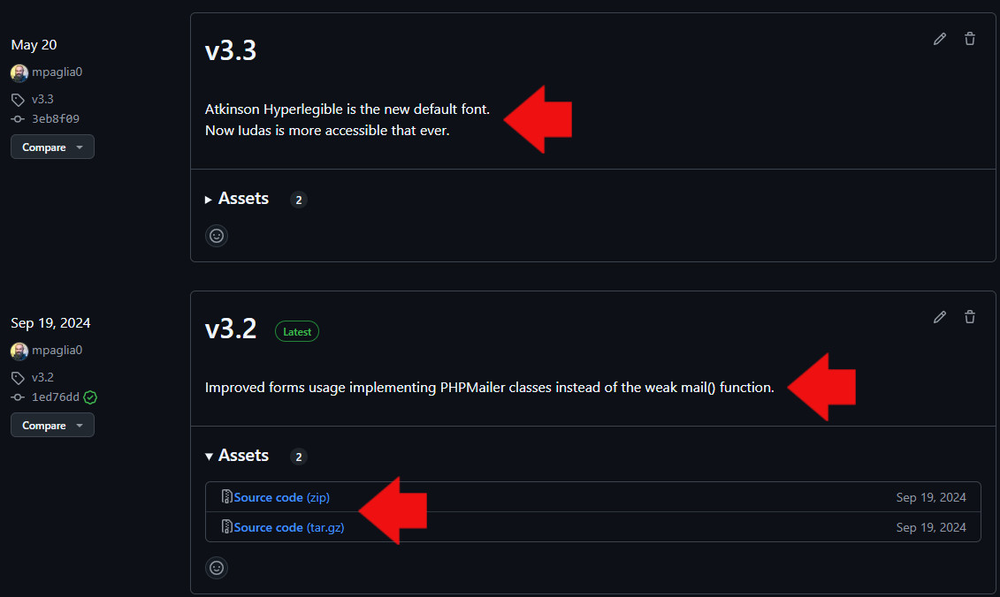

# How to install and run Iudas for the first time

## A quick guide

### Introduction

Installation of themes in Pelican is a very easy task!

The dedicated Pelican `pelican-themes` command line utility will do all the job! `pelican-themes` utility is included in your standard Pelican installation. The official guide can be found [HERE](https://docs.getpelican.com/en/latest/pelican-themes.html).

>>>>>> TODO
>>>>>> Command line examples?

### How Iudas project is organized

Branches can be created and deleted as per my personal use but you will ever find two of them:

- main

- dev

**dev** is the development branch. **Never** use these files for production websites. I cannot guarantee theme in *dev* branch will work. Probably it will not...

**main** is the stable branch. These files have been tested and proved to work well.

The *main* branch is evolving, I can apply here also small changes, fixes etc. Consider *main* branch as a *rolling release*, so my suggestion is **do not use main branch files** for your site but use *Releases* packages instead.

Releases are published only when new features are available/complete, and in the Release page you can find the Changelog with the main news.

Click on the archive you need, unzip it, and you will have all the necessary files at place.

Please note the unpacked root theme directory have the complete name (i.e. Iudas-`version`). So - at your choice - you can use the theme as follows:

- Rename Iudas-`version` in *Iudas* and overwrite the old directory (install *Iudas* on top of the old one). In this way the old theme will be replaced by the new one.

- Keep the directory AS IS in order to have available a 'theme history'. The theme will be installed along with previous versions (Iudas-3.1, Iudas-3.1.1 etc.) Update the theme name in your `pelicanconf.py` file and rebuild the website in order to have the new version. In this way you could also 'downgrade' a theme if you are not happy with it simply changing the relevant parameter in `pelicanconf.py` and rebuild the website!
